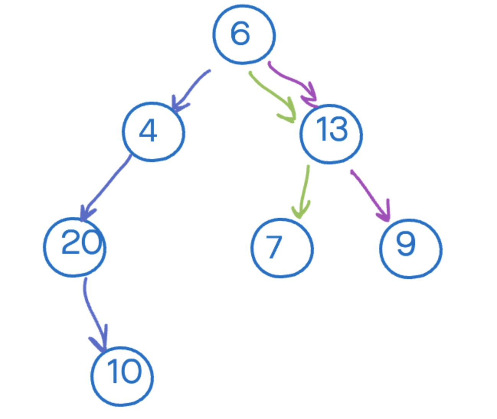

# Warm Up - Find the Ancestors of a given Node in a Binary Tree

## Overview

Trees are used to store all sorts of heirarchical information.  The parents and grand parents of a node might represent some sort of important connection between those values.  So it is sometimes necessary to be able to return a list of all the `ancestors` belonging to a given node value.

The following tree has three seperate `lineages` running through it:

## Challenge

Create a function that can search the tree for a specific value, if the value is found, return a linked list of all the nodes `ancestors`  that connect that node to the `root` of the tree.
