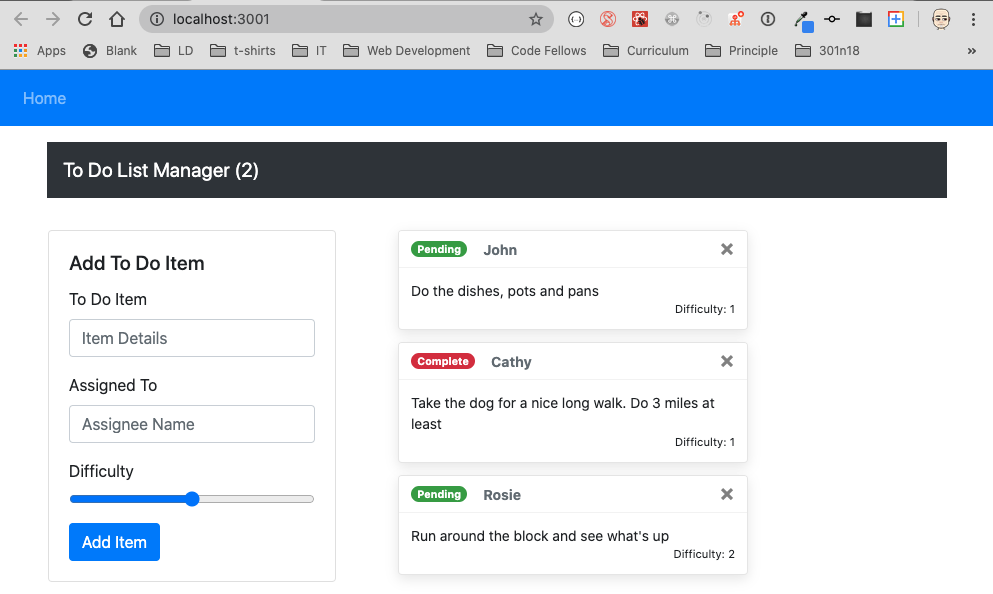

# LAB - Custom Hooks

**To Do List Manager Phase 2:** Connecting the To Do Application to an external API and Database

In this phase, we'll be connecting our application to an API so that our list will be saved permanently. This will require a working and deployed API server with a proper "To Do" data model and appropriate REST routes

## Before you begin

Refer to *Getting Started*  in the [lab submission instructions](../../../reference/submission-instructions/labs/README.md) for complete setup, configuration, deployment, and submission instructions.

> Building off of your previous day's branch, create a new branch for today called 'custom-hooks' and continue to work in your 'todo' repository.

## Business Requirements

Refer to the [To Do System Overview](../../apps-and-libraries/todo/README.md) for a complete review of the application, including Business and Technical requirements along with the development roadmap.

## Phase 2 Requirements

In Phase 2, we're going to connect the To Do Manager to a deployed API, backed by a database. The core functionality and stories do not change (reference Phase 1), but a new one has been added to note this shift in persistence.

- As a user, I would like to be able to add, update, and delete To Do items
- As a user, I would like my To Do Items to be permanently stored so that I can re-access them at any time, using any device

Note that the display of each To Do item has changed slightly.

## Technical Requirements / Notes

Technical requirements for the core application are unchanged from **Phase 1**, with the following exceptions and notes:

Workflow changes:

- On application start, display all of the to do items from the API/Database
- When **adding** an item, issue a `POST` request to the API server
- When **marking items complete**, issue a `PUT` request to the API server for the item
- When **deleting** items, issue a `DELETE` request to the API server for the item

Implementation Requirements

- Design Requirement
  - Follow the included mockup
  - Implement using [React Bootstrap Components](https://react-bootstrap.github.io/), not your own bespoke markup/css
- API
  - You have previously built a working, and deployed API server that handles data models such as `categories` and `products`
  - Add a new data model for "To Do" items as noted in the Business Requirements document, and deploy it to Heroku

- Hooks:
  - Use the `useEffect()` hook to pre-load the To Do Items from the API on application start
  - Replace the current form change/submit handlers with the `useForm()` custom hook to manage the "Add Item" form
  - Create a new custom hook called `useAjax()` to abstract the API calls
    - Using this hook in your component should make the calls to the server
    - This hook should:
      - Accept the URL to the API server, the REST method, and (when relevant) the BODY (JSON) of the request
      - Handle CORS Settings, Content-Type, Headers and possibly authentication
      - You should use `axios` to perform the actual AJAX calls

> TIP: Before you write the `useAjax()` hook, get the application connected to and using your deployed api, with `axios` in your event handlers. **Once you have it working end to end**, migrate that same logic into using a hook. You'll find that writing the hook will require the use of effects and some event-driven thinking (with state) to operate. Here's a [great article](https://medium.com/swlh/usefetch-a-custom-react-hook-36d5f5819d8) to get you started

### Stretch Goals

- Allow the user to dynamically sort to do items by date, difficulty, or assignee
- Allow the user to filter to do items by date, difficulty, or assignee
- Implement a 3rd party form hook instead of the custom one we wrote
- Implement a 3rd party ajax/fetch hook instead of the custom one you wrote for lab

> Why would we have you build custom hooks only to make it a stretch goal to replace them? Implementing 3rd party code is often the preferred way to go. They are well tested and in many cases more able to scale. You get to read someone else's documentation. **And**, you can look at their source code to see how they did it, learning new techniques along the way. Do this after you write your own so that you can compare and contrast...

### Testing

- Tests should assert all behavioral functionality

### Assignment Submission Instructions

Refer to the the [Submitting React Apps Lab Submission Instructions](../../../reference/submission-instructions/labs/react-apps.md) for the complete lab submission process and expectations
